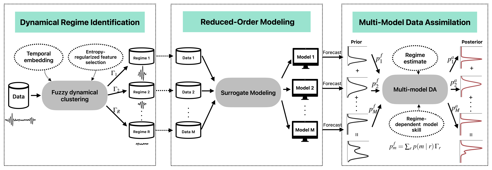

# [A Regime-Dependent Multi-Model Framework for Data Assimilation and Prediction]()


Complex dynamical systems often alternate between qualitatively distinct regimes. Predicting such systems benefits from combining multiple models whose relative skill varies across regimes. This work develops a regime-dependent multi-model framework for sequential prediction and data assimilation that adaptively weights models according to the current regime and their regime-dependent skill. The framework adopts a mixture-prior Bayesian formulation that preserves the multimodality induced by regime transitions. The key modeling step factorizes the prior model weights through a latent regime variable. Regime probabilities are estimated online using fuzzy C-means clustering, while regime-conditional model weights are calibrated offline from regime-wise forecast errors. The resulting method is implemented as a Gaussian-mixture multi-model ensemble Kalman filter (GMMM-EnKF), which extends the standard EnKF with minimal additional computational cost and includes two ensemble-reallocation procedures that align sub-ensemble sizes with mixture weights while preserving most trajectory continuity. The framework is tested on three systems of increasing complexity: (i) a noisy two-regime Lorenz-63 system, (ii) a turbulent topographic barotropic flow with intermittent extreme events, and (iii) an ENSO assimilation and prediction problem driven by CMIP6 surrogates. Across all three systems, GMMM-EnKF attains the lowest relative posterior RMSE against both single-model and standard multi-model EnKF baselines.
## Paper
If you find the code useful, please consider citing the paper 
```

```
